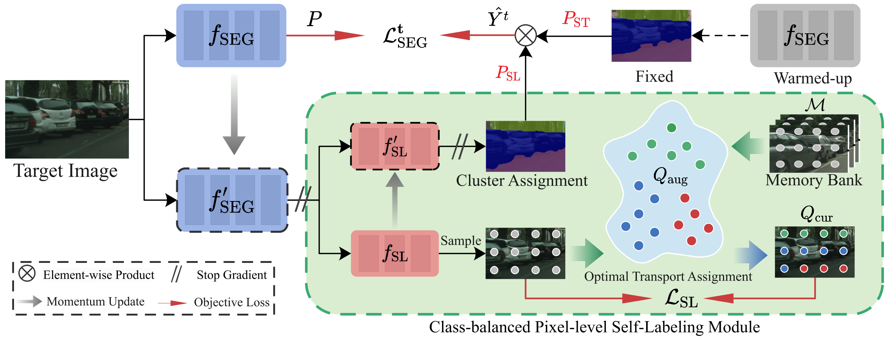

# CPSL: Class-Balanced Pixel-Level Self-Labeling for Domain Adaptive Semantic Segmentation (CVPR 2022, official Pytorch implementation)

### [Paper](https://arxiv.org/abs/2203.09744)




## Abstract
>Domain adaptive semantic segmentation aims to learn a model with the supervision of source domain data, and produce satisfactory dense predictions on unlabeled target domain. One popular solution to this challenging task is self-training, which selects high-scoring predictions on target samples as pseudo labels for training. However, the produced pseudo labels often contain much noise because the model is biased to source domain as well as majority categories. To address the above issues, we propose to directly explore the intrinsic pixel distributions of target domain data, instead of heavily relying on the source domain. Specifically, we simultaneously cluster pixels and rectify pseudo labels with the obtained cluster assignments. This process is done in an online fashion so that pseudo labels could co-evolve with the segmentation model without extra training rounds. To overcome the class imbalance problem on long-tailed categories, we employ a distribution alignment technique to enforce the marginal class distribution of cluster assignments to be close to that of pseudo labels. The proposed method, namely Class-balanced Pixel-level Self-Labeling (CPSL), improves the segmentation performance on target domain over state-of-the-arts by a large margin, especially on long-tailed categories.

## Installation
Install dependencies:
```bash
pip install -r requirements.txt
```
## Data Preparation 
Download [Cityscapes](https://www.cityscapes-dataset.com/), [GTA5](https://download.visinf.tu-darmstadt.de/data/from_games/) and [SYNTHIA-RAND-CITYSCAPES](http://synthia-dataset.net/downloads/).

We expect dataset folder to be like
```
└── dataset
    ├── cityscapes
    │   ├── annotations
    │   ├── gtFine
    │   └── leftImg8bit
    ├── GTA5
    │   ├── images
    │   ├── labels
    │   └── split.mat
    ├── SYNTHIA
    │   ├── GT
    │   ├── RGB
    └── └── meta.json

```

## Models
| backbone  | warmed-up models (41.4 mIoU) | Stage1 self-labeling (55.7 mIoU) |  Stage2 KD-1 (59.4 mIoU) | Stage3 KD-2 (60.8 mIoU) |
|:----------:|:------:|:----:|:----:|:----:|
| ResNet101 | [model](https://drive.google.com/file/d/1g6J1PpX1mYorNWGcj9mbnvpK8WNQMMDG/view?usp=sharing)  | [model](https://drive.google.com/file/d/1NMcdUUBzwdhosGdiIFJZUll_p9nQ-i5O/view?usp=sharing), [log1](docs/stage1.log) | [model](https://drive.google.com/file/d/1OkKjlDRRzOYLWUETHLo55YMqKf0O8ySy/view?usp=sharing), [log2](docs/stage2.log)| [model](https://drive.google.com/file/d/1ImTM4aBk0STMXCmJiQs1HWmEBKeL4xs4/view?usp=sharing), [log3](docs/stage3.log) | 

We expect models folder to be like
```
├── pretrained_models
|   └── from_gta5_to_cityscapes_on_deeplabv2_best_model.pkl
└── logs
    ├── gta2citylabv2_stage1Denoise
    |   └──from_gta5_to_cityscapes_on_deeplabv2_best_model.pkl
    ├── gta2citylabv2_stage2
    │   └── from_gta5_to_cityscapes_on_deeplabv2_best_model.pkl
    └── gta2citylabv2_stage3
        └── from_gta5_to_cityscapes_on_deeplabv2_best_model.pkl

```
 
  
## Traning
To reproduce the performance, you need 4 GPUs with no less than 16G memory.

<details>
    <summary>
        Stage1.
    </summary>
    
- **Stage1.**   The log of Stage 1: [logs](docs/stage1.log)
    
    * Generate soft pseudo label.
    ```bash
    python generate_pseudo_label.py --name gta2citylabv2_warmup_soft --soft --resume_path  \
    ./pretrained_models/from_gta5_to_cityscapes_on_deeplabv2_best_model.pkl --no_droplast
    ```
    * Calculate prototypes for weight initialization.
    ```bash
    python calc_prototype.py --resume_path \
    ./pretrained_models/from_gta5_to_cityscapes_on_deeplabv2_best_model.pkl
    ```
    * Calculate class distribution.   The class distribution is given: [class_distribution](Pseudo/class_distribution.npy)
    ```bash
    python generate_class_distribution.py --name gta2citylabv2_warmup_soft --soft \
    --resume_path  ./pretrained_models/from_gta5_to_cityscapes_on_deeplabv2_best_model.pkl --no_droplast --class_balance
    ```
    * train the model.
    ```train stage1
    python train.py --name gta2citylabv2_stage1Denoise --used_save_pseudo --ema --proto_rectify \
    --path_soft Pseudo/gta2citylabv2_warmup_soft \
    --resume_path ./pretrained_models/from_gta5_to_cityscapes_on_deeplabv2_best_model.pkl \
    --rce --proto_consistW 5 --SL_lambda 0.1
    ```

   </details>
   
<details>
    <summary>
        Stage2.
    </summary>
    
- **Stage2.**  The log of Stage 2: [logs](docs/stage2.log)
    
    * Generate soft pseudo label.
    ```bash
    python generate_pseudo_label.py --name gta2citylabv2_stage1Denoise --flip \
    --resume_path ./logs/gta2citylabv2_stage1Denoise/from_gta5_to_cityscapes_on_deeplabv2_best_model.pkl --no_droplast
    ```   
    * train stage2.
    ```bash
    python train.py --name gta2citylabv2_stage2 --stage stage2 --used_save_pseudo \
    --path_LP Pseudo/gta2citylabv2_stage1Denoise \
    --resume_path ./logs/gta2citylabv2_stage1Denoise/from_gta5_to_cityscapes_on_deeplabv2_best_model.pkl \
    --S_pseudo 1 --threshold 0.95 --distillation 1 --finetune --lr 6e-4 --student_init simclr --bn_clr --no_resume
    ```   
</details>

<details>
    <summary>
        Stage3.
    </summary>
    
- **Stage3.**   The log of Stage 3: [logs](docs/stage3.log)

    * Generate soft pseudo label.
    ```bash
    python generate_pseudo_label.py --name gta2citylabv2_stage2 --flip \
    --resume_path ./logs/gta2citylabv2_stage2/from_gta5_to_cityscapes_on_deeplabv2_best_model.pkl --no_droplast\
    --bn_clr --student_init simclr
    ```   
    * train stage3.
    ```bash
    python train.py --name gta2citylabv2_stage3 --stage stage3 --used_save_pseudo \
    --path_LP Pseudo/gta2citylabv2_stage2 \
    --resume_path ./logs/gta2citylabv2_stage2/from_gta5_to_cityscapes_on_deeplabv2_best_model.pkl \
    --S_pseudo 1 --threshold 0.95 --distillation 1 --finetune --lr 6e-4 --student_init simclr --bn_clr --ema_bn
    ```  
</details>
    
    
    
## Inference
```bash
python test.py --bn_clr --student_init simclr --resume ./logs/gta2citylabv2_stage3/from_gta5_to_cityscapes_on_deeplabv2_best_model.pkl
```


## Citation
If you like our work and use the code or models for your research, please cite our work as follows.
```
@article{li2022class,
    title={Class-Balanced Pixel-Level Self-Labeling for Domain Adaptive Semantic Segmentation},
    author={Li, Ruihuang and Li, Shuai and He, Chenhang and Zhang, Yabin and Jia, Xu and Zhang, Lei},
    journal={CVPR 2022},
    year={2022}
}
```

## Acknowledgments
This code is heavily borrowed from [ProDA](https://github.com/microsoft/ProDA). 
